# zsh-static-docker



## get started

run it on posix-sh:

```sh
# Depends: awk, coreutils, curl, sh
# Suggests: docker.io | docker

# values: latest, rv64gc, x64, x86, loong64,
#       arm64, armv7a, armv5te, armv4t, armv3,
#       mips64le, mipsle, mipsbe, m68k, sh4,
#       s390x, alpha, hppa, sparc64, sparc,
#       ppc64le, ppc64, ppc, x32, ia64
tag=latest

# ------------
get_bin_without_docker() {
    mkdir -p tmp

    awk_args="$(cat<<'EOF'
    BEGIN {
        true = 1
        false = 0
        user = "2moe"
        image = "zsh-static"
        sprintf("curl 'https://ghcr.io/token?scope=repository:%s/%s:pull'", user, image) | getline
        token = $4

        curl_cmd = sprintf("curl -H 'Authorization: Bearer %s' https://ghcr.io/v2/%s/%s", token, user, image)

        get_digest = false
        while (sprintf("%s/manifests/%s", curl_cmd, tag) | getline > 0) {
            if ($4 ~ /vnd.docker.image.rootfs/) {
                get_digest = true
            }
            if ($2 == "digest" && get_digest) {
                digest = $4
                break
            }
        }
        system(sprintf("%s/blobs/%s -Lo %s", curl_cmd, digest, layer_file))
    }
EOF
)"

    layer=tmp/layer.tar.gz

    case $tag in
        latest)
            arch=$(uname -m)
            case $arch in
                riscv64)     tag=rv64gc ;;
                x86_64)      tag=x64    ;;
                aarch64)     tag=arm64  ;;
                loong*64)    tag=loong64;;
                i*86)        tag=x86    ;;
                [1-9][0-9]*) tag=latest ;;
            esac
    esac

    [ $tag = latest ] || {
        awk -F'"' -v tag=$tag -v layer_file=$layer "$awk_args"
        tar -C tmp -xvf $layer
        for i in busybox zsh; do
            install -m755 ./tmp/opt/bin/$i ./tmp/$i
        done
        return
    }
    echo >&2 "[ERROR] Please change the value of 'tag=latest' to the architecture name (e.g., 'tag=armv7a')."
}

get_bin() {
    docker ps >/dev/null || {
        get_bin_without_docker
        return
    }
    for bin in busybox zsh; do
        docker run --rm -v "$PWD/tmp":/app ghcr.io/2moe/zsh-static:$tag cp -L /opt/bin/$bin /app/
    done
}

get_bin
# test: print Hello World
./tmp/zsh -fc 'print -P "%F{blue}Hello %F{cyan}World%f"'
./tmp/busybox
```
